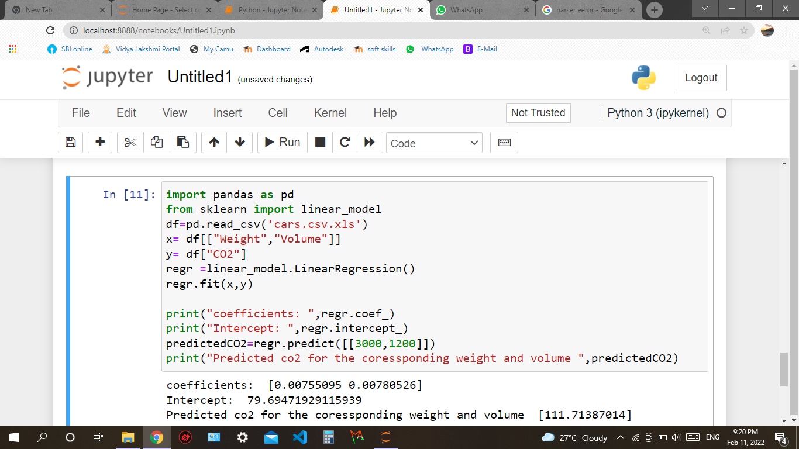

# Implementation of Multivariate Linear Regression
## Aim
To write a python program to implement multivariate linear regression and predict the output.
## Equipment’s required:
1.	Hardware – PCs
2.	Anaconda – Python 3.7 Installation / Moodle-Code Runner
## Algorithm:
### Step1:
Import pandas.
### Step2:
Import linear_modal from sklearn.
### Step3:
Read the file using read_csv.
### Step4:
Get the inputs from the user as x and y.
### Step5:
Use regr.fit(x,y) to et the output.

## Program:
```
Name:J.Archana priya
Reg no:21500533

import pandas as pd
from sklearn import linear_model
df=pd.read_csv('cars.csv.xls')
x= df[["Weight","Volume"]]
y= df["CO2"]
regr =linear_model.LinearRegression()
regr.fit(x,y)

print("coefficients: ",regr.coef_)
print("Intercept: ",regr.intercept_)
predictedCO2=regr.predict([[3000,1200]])
print("Predicted co2 for the coressponding weight and volume ",predictedCO2)
```
## Output:



## Result
Thus the multivariate linear regression is implemented and predicted the output using python program.